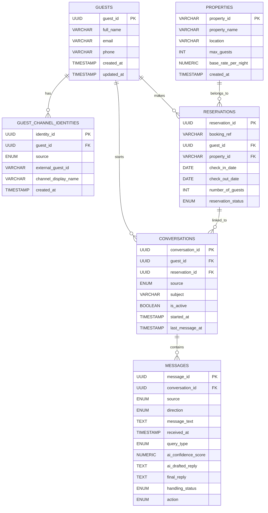

# Nistula Technical Assessment

The project is divided into three parts:

1. **Part 1:** Guest Message Handler using FastAPI and Claude API  
2. **Part 2:** PostgreSQL database schema for the unified messaging platform  
3. **Part 3:** Written thinking response for a real guest complaint scenario  

---

## Project Overview

Nistula receives guest messages from multiple channels such as WhatsApp, Booking.com, Airbnb, Instagram and direct enquiries.

This project builds a backend system that:

- Receives inbound guest messages through a webhook endpoint
- Normalises messages into a unified internal schema
- Classifies the message into a query type
- Sends the message to Claude with relevant property context
- Returns a drafted guest reply
- Calculates a confidence score
- Decides whether the reply can be auto-sent, reviewed by an agent or escalated

---

## Repository Structure

```text
nistula-technical-assessment/
│
├── app/
│   ├── main.py
│   ├── models.py
│   ├── classifier.py
│   ├── claude_client.py
│   ├── confidence.py
│   └── property_context.py
│
├── schema.sql
├── thinking.md
├── .env.example
├── .gitignore
├── requirements.txt
└── README.md
```

---

## Tech Stack

- Python
- FastAPI
- Uvicorn
- Pydantic
- Anthropic Claude API
- PostgreSQL

---

# Part 1: Guest Message Handler

## API Endpoint

```text
POST /webhook/message
```

The endpoint receives an inbound guest message and returns a drafted reply with confidence score and action.

---

## Sample Request

```json
{
  "source": "whatsapp",
  "guest_name": "Rahul Sharma",
  "message": "Is the villa available from April 20 to 24? What is the rate for 2 adults?",
  "timestamp": "2026-05-05T10:30:00Z",
  "booking_ref": "NIS-2024-0891",
  "property_id": "villa-b1"
}
```

---

## Sample Response

```json
{
  "message_id": "451daf40-84b3-41c7-ab69-b11dc4b9ae39",
  "query_type": "pre_sales_availability",
  "drafted_reply": "Hi Rahul! Great news, Villa B1 is available from April 20 to 24. The base rate is INR 18,000 per night for up to 4 guests.",
  "confidence_score": 0.91,
  "action": "auto_send"
}
```

---

## Supported Source Channels

The system accepts messages from the following sources:

- `whatsapp`
- `booking_com`
- `airbnb`
- `instagram`
- `direct`

Any other source returns a validation error.

---

## Query Types

Each guest message is classified into one of the following query types:

| Query Type | Description |
|---|---|
| `pre_sales_availability` | Guest asks whether the villa is available for specific dates |
| `pre_sales_pricing` | Guest asks about price, rate, or total cost |
| `post_sales_checkin` | Guest asks about check-in, check-out, WiFi, or arrival details |
| `special_request` | Guest asks for chef, airport transfer, early check-in, decor, etc. |
| `complaint` | Guest reports an issue or dissatisfaction |
| `general_enquiry` | General property question |

The classifier is rule-based and keyword-driven. I chose this approach because it is easy to understand, debug, and extend.

---

## Mock Property Context

The Claude prompt uses the following property context:

```text
Property: Villa B1, Assagao, North Goa
Bedrooms: 3
Max guests: 6
Private pool: Yes
Check-in: 2pm
Check-out: 11am
Base rate: INR 18,000 per night up to 4 guests
Extra guest: INR 2,000 per night per person
WiFi password: Nistula@2024
Caretaker: Available 8am to 10pm
Chef on call: Yes, pre-booking required
Availability April 20-24: Available
Cancellation: Free up to 7 days before check-in
```

Claude is instructed to answer only using the available property context and not invent missing information.

---

## Setup Instructions

### 1. Clone the repository

```bash
git clone https://github.com/your-username/nistula-technical-assessment.git
cd nistula-technical-assessment
```

### 2. Create a virtual environment

For Windows:

```bash
python -m venv venv
venv\Scripts\activate
```

For macOS/Linux:

```bash
python3 -m venv venv
source venv/bin/activate
```

### 3. Install dependencies

```bash
pip install -r requirements.txt
```

If `requirements.txt` has not been generated, install manually:

```bash
pip install fastapi uvicorn anthropic python-dotenv pydantic
```

### 4. Create `.env`

Create a `.env` file in the root folder:

```env
ANTHROPIC_API_KEY=your_api_key_here
CLAUDE_MODEL=claude-sonnet-4-20250514
```

The actual `.env` file is not included in this repository.

---

## Running the Project

Start the FastAPI server:

```bash
uvicorn app.main:app --reload
```

If port 8000 is already in use:

```bash
uvicorn app.main:app --reload --port 8001
```

Open Swagger UI:

```text
http://127.0.0.1:8000/docs
```

or:

```text
http://127.0.0.1:8001/docs
```

---

## Health Check

```text
GET /
```

Expected response:

```json
{
  "status": "running",
  "service": "Nistula Guest Message Handler"
}
```

---

## Confidence Scoring Logic

The confidence score is calculated by the backend after Claude generates the drafted reply.

Claude is responsible only for drafting the guest-facing message. The backend calculates the confidence score using deterministic rules so that the logic is transparent and explainable.

The confidence score considers:

- Query type risk
- Whether Claude successfully returned a reply
- Whether the property ID is present
- Whether the booking reference is present
- Message length and clarity
- Number of matching intent keywords
- Whether the message contains mixed intents
- Uncertainty terms such as “maybe”, “not sure”, or “if possible”
- High-risk terms such as “refund”, “broken”, “unsafe”, or “emergency”
- Whether the message is a complaint

Different query types start with different base confidence scores. For example, check-in and availability questions are usually easier to answer from the property context, while special requests and general enquiries may require agent review.

Complaints are always escalated even if Claude successfully drafts a reply, because guest dissatisfaction should be reviewed by a human.

---

## Action Decision Logic

| Condition | Action |
|---|---|
| Confidence score above `0.85` | `auto_send` |
| Confidence score between `0.60` and `0.85` | `agent_review` |
| Confidence score below `0.60` | `escalate` |
| Query type is `complaint` | `escalate` |

---

## Test Cases

### 1. Availability Query

```json
{
  "source": "whatsapp",
  "guest_name": "Rahul Sharma",
  "message": "Is the villa available from April 20 to 24?",
  "timestamp": "2026-05-05T10:30:00Z",
  "booking_ref": "NIS-2024-0891",
  "property_id": "villa-b1"
}
```

Expected:

```text
query_type: pre_sales_availability
action: auto_send
```

---

### 2. Pricing Query

```json
{
  "source": "direct",
  "guest_name": "Priya Nair",
  "message": "What is the total rate for 5 guests for 3 nights?",
  "timestamp": "2026-05-05T11:00:00Z",
  "booking_ref": "NIS-2024-0901",
  "property_id": "villa-b1"
}
```

Expected:

```text
query_type: pre_sales_pricing
action: auto_send or agent_review
```

---

### 3. Check-in and WiFi Query

```json
{
  "source": "airbnb",
  "guest_name": "Ananya Mehta",
  "message": "What time can we check in and what is the WiFi password?",
  "timestamp": "2026-05-05T12:15:00Z",
  "booking_ref": "NIS-2024-0999",
  "property_id": "villa-b1"
}
```

Expected:

```text
query_type: post_sales_checkin
action: auto_send
```

---

### 4. Special Request

```json
{
  "source": "instagram",
  "guest_name": "Meera Kapoor",
  "message": "Can you arrange a chef for dinner during our stay?",
  "timestamp": "2026-05-05T16:45:00Z",
  "booking_ref": "NIS-2024-1120",
  "property_id": "villa-b1"
}
```

Expected:

```text
query_type: special_request
action: agent_review
```

---

### 5. Complaint

```json
{
  "source": "booking_com",
  "guest_name": "Vikram Rao",
  "message": "The AC is not working and I am not happy with the property.",
  "timestamp": "2026-05-05T14:20:00Z",
  "booking_ref": "NIS-2024-1012",
  "property_id": "villa-b1"
}
```

Expected:

```text
query_type: complaint
action: escalate
```

---

### 6. General Enquiry

```json
{
  "source": "whatsapp",
  "guest_name": "Aman Verma",
  "message": "Do you allow pets at the villa?",
  "timestamp": "2026-05-05T18:10:00Z",
  "booking_ref": "NIS-2024-1188",
  "property_id": "villa-b1"
}
```

Expected:

```text
query_type: general_enquiry
action: agent_review
```

---

### 7. Invalid Source

```json
{
  "source": "sms",
  "guest_name": "Test User",
  "message": "Is the villa available?",
  "timestamp": "2026-05-05T10:30:00Z",
  "booking_ref": "NIS-2024-0001",
  "property_id": "villa-b1"
}
```

Expected:

```text
422 Validation Error
```

---

# Part 2: PostgreSQL Database Schema

The SQL schema is available in:

```text
schema.sql
```

The schema supports:

1. Guest profiles with one record per guest across all channels
2. All messages across all channels in one table
3. Conversations linked to guests and reservations
4. Tracking whether a message was AI drafted, agent edited, auto-sent, or escalated
5. Storing AI confidence score and query type per inbound message

---

## Database Tables

| Table | Purpose |
|---|---|
| `guests` | Stores one main profile per guest |
| `guest_channel_identities` | Maps guests to different channel identities |
| `properties` | Stores property information |
| `reservations` | Stores booking and reservation details |
| `conversations` | Groups related messages between a guest and Nistula |
| `messages` | Stores all inbound and outbound messages across channels |

---

## PostgreSQL Schema Diagram



---

## Database Design Decisions

I designed the schema around a unified messaging model where all guest messages from WhatsApp, Booking.com, Airbnb, Instagram, and direct channels are stored in a single `messages` table. This avoids creating separate tables for each channel and makes it easier to search, analyse, and process messages consistently.

The `guests` table stores the main guest profile, while `guest_channel_identities` stores channel-specific identifiers. This is important because the same guest may contact Nistula through multiple channels. For example, a guest may first enquire through Instagram and later continue the conversation through WhatsApp.

The `conversations` table links guests to reservations. A conversation can be connected to a reservation when a booking reference exists, but it can also exist without a confirmed reservation. This supports both pre-sales enquiries and post-booking communication.

The `messages` table stores both inbound and outbound messages. It includes fields for query type, AI confidence score, AI drafted reply, final reply, handling status, and action. This allows the system to track whether a message was only drafted by AI, edited by an agent, auto-sent, or escalated for manual handling.

---

## Hardest Database Design Decision

The hardest design decision was deciding where to store the AI-generated reply and the final agent-handled reply.

Initially, I considered creating a separate table only for AI outputs, because in a larger production system there may be multiple AI drafts, retries, edits, or version history for the same message.

However, for this assessment, I kept the AI draft, final reply, confidence score, query type, handling status, and action inside the `messages` table. I chose this because these fields are directly connected to the inbound guest message. Keeping them in one table makes the schema easier to understand, easier to query, and suitable for the current scope.

For example, if an agent wants to review a message, they can see the original guest message, AI draft, confidence score, final action, and handling status from the same table. In a future production version, I would separate AI attempts and agent edits into an audit or message versioning table so every draft, edit, and decision can be tracked historically.

---

# Part 3: Thinking Question

The answer to the 3am hot water complaint scenario is available in:

```text
thinking.md
```

It covers:

- The immediate AI reply
- The full system escalation flow
- How the platform should learn from repeated complaints

---

## Error Handling

The backend handles errors in the following ways:

- Invalid request payloads return FastAPI validation errors.
- Invalid source values return a `422 Validation Error`.
- Claude API errors return a safe fallback guest reply.
- Confidence score is reduced if Claude does not respond successfully.
- Complaints are always escalated for human review.

---

## Security Note

The Claude API key is stored in `.env` and is never hardcoded in the source code.

The repository includes only:

```text
.env.example
```

The actual `.env` file is excluded using `.gitignore`.

---

## Future Improvements

With more time, I would add:

- Unit tests for query classification and confidence scoring
- PostgreSQL integration for storing messages
- Agent dashboard for reviewing and editing AI replies
- Message versioning for AI drafts and agent edits
- Better guest identity matching across channels
- Background escalation jobs for unresolved urgent complaints
- Analytics dashboard for recurring complaints and property issues

---

## Submission

GitHub Repository:

```text
https://github.com/your-username/nistula-technical-assessment
```
